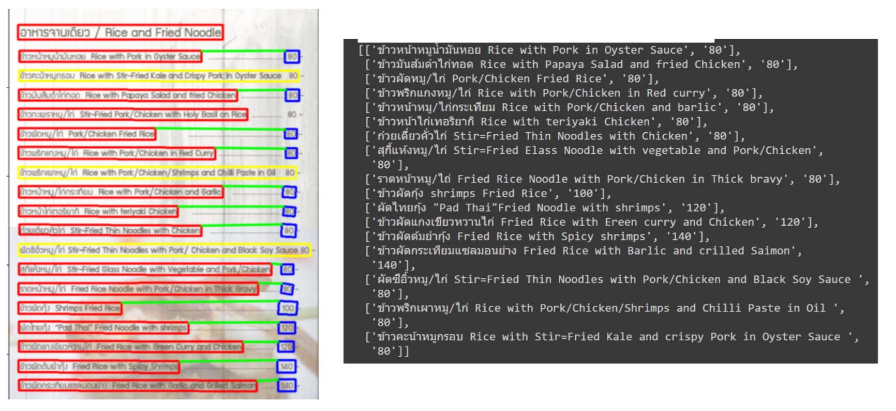
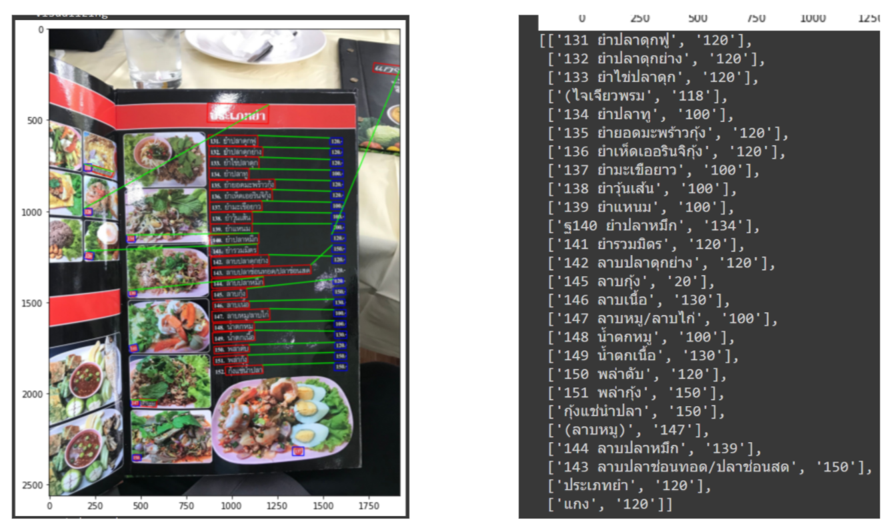
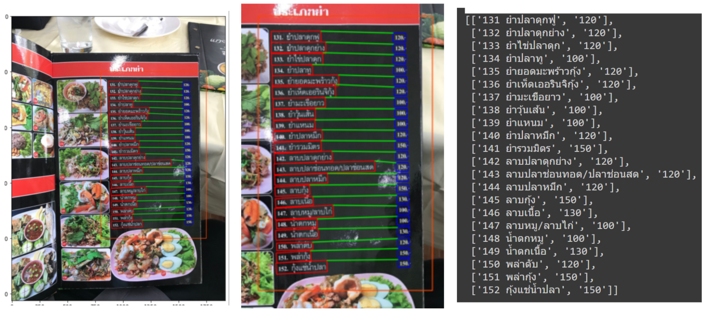
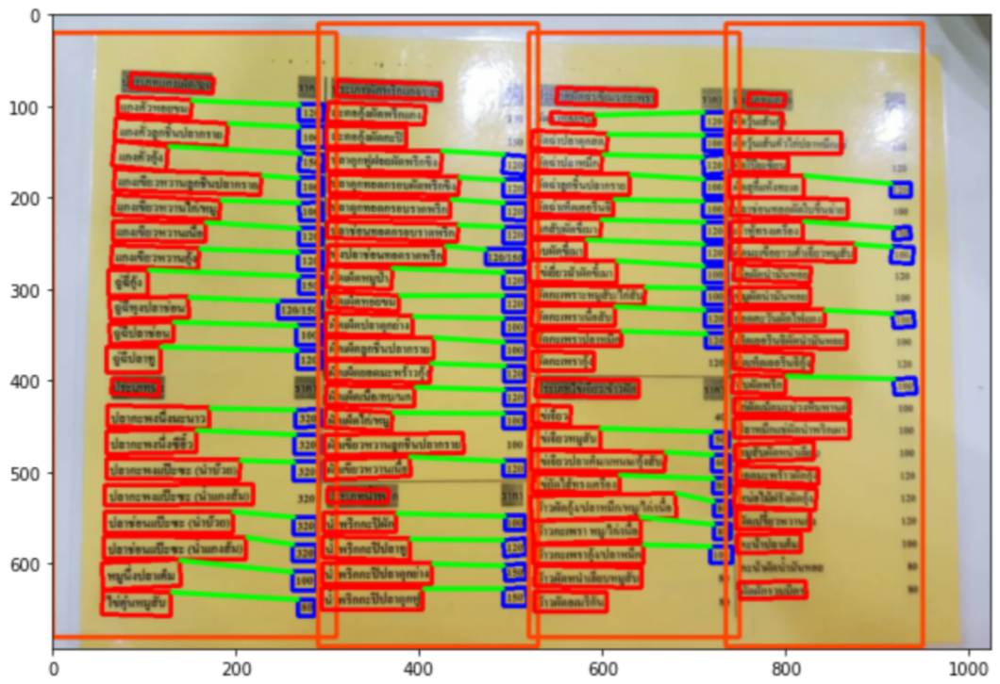
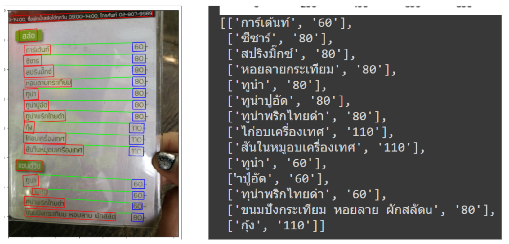

# STR-food-menu-TH
Scene Text Recognition on Thai food menu image

## Overview
This project is `Scene Text Recognition(STR)`, subset of `Optical Character Recognition(OCR)`, means we are trying to extract the text from the image and the domain of this project is Thai food menu images which is `table-like` data. As the Text Localization model and Text Recognition model are private model, so they are not provided in this repository. However, I've provided all pipeline code and the behavior of the missing model function, hence you can put your models into the blank space in the code.

## Scope Of Work
- Thai food menu image
- `Dishname` should be in the form of Thai text
- The content should be in the form of "Front + Dishname + Price + Back"
  - `Front`: The text in front of `Dishname` e.g. `1  `, `1.`, `1.  `
  - `Dishname`: The name of dish
  - `Price`: The price of dishname
  - `Back`: The text behind the `Price` e.g. `  บาท`, `-`, `.-`, `.-  บาท`and `บ.` 
- Not only recognize the dish name and price but the model should also be able to pair them correctly (return as a list of list of each pair)

## Pipeline
- Preprocessing: `ROI` from user
- Text Localization: Private model
- Text Recognition: Private model
- Post Processing: `Matching Algorithm`

## Preprocessing
We need `ROI`(Region Of Interest) from the users to fix `2` problems
- To deal with outlier in image
### Without ROI

### With ROI

- To deal with the image that there are more than `1` region in the image

## Text Localization
To localize the text in image

## Text Recognition
To recognize the text in the output image  from text from Text Localizer

## Post Processing
There are `2` steps in `Matching Algorithm`:
1. Classify whether each text are `dishname`(+`front`) or `price`(+`back`) using the index of number in text
2. Map the dishname and its price using `Perpendicular Distance` between them

## Demonstration

